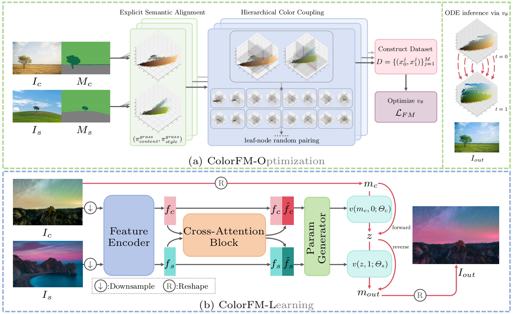
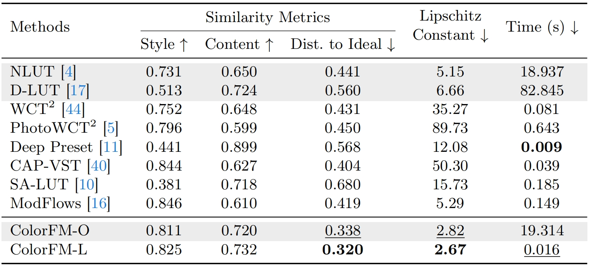

# [ColorFM: An Optimization-to-Learning Framework for Color Transfer via Flow Matching](https://arxiv.org/abs/2607.07119)

<p align="center">
  <a href="https://github.com/heyh31">Yuhang He</a><sup>1</sup>,
  <a href="https://github.com/cszn">Kai Zhang</a><sup>1,&#8224;</sup>,
  Xiaoming Li<sup>1</sup>,
  Du Chen<sup>2</sup>,
  Jian Yang<sup>1</sup>
</p>

<p align="center">
  <sup>1</sup>Nanjing University, China &nbsp;&nbsp;
  <sup>2</sup>VIVO BlueImage Lab, China<br>
  <sup>&#8224;</sup>Corresponding author
</p>

<p align="center"><strong>ECCV 2026</strong></p>

<p align="center">
  <a href="https://arxiv.org/abs/2607.07119">
    
  </a>
  <a href="https://heyh31.github.io/ColorFM_page/">
    
  </a>
</p>

---

- [ColorFM: An Optimization-to-Learning Framework for Color Transfer via Flow Matching](#colorfm-an-optimization-to-learning-framework-for-color-transfer-via-flow-matching)
  - [Overview](#overview)
  - [Online Demos](#online-demos)
  - [Method](#method)
  - [Quantitative Results](#quantitative-results)
  - [Image Color Transfer](#image-color-transfer)
  - [Video Color Transfer](#video-color-transfer)
  - [Citation](#citation)

Overview
----------

ColorFM is an optimization-to-learning framework for accurate and semantically consistent color transfer. It connects instance-specific optimization with efficient feed-forward inference through two complementary variants: ColorFM-O and ColorFM-L.

Online Demos
----------

| Method | Type | Demo |
|:---:|:---:|:---:|
| ColorFM-O | Optimization-based | [Try online](https://huggingface.co/spaces/heyh97791/ColorFM-O) |
| ColorFM-L | Learning-based | [Try online](https://huggingface.co/spaces/heyh97791/ColorFM-L) |

Method
----------

ColorFM formulates color transfer as transporting pixel distributions along velocity fields via Flow Matching. ColorFM-O optimizes an instance-specific velocity field with semantic guidance, while ColorFM-L learns from the generated pairs to provide efficient feed-forward inference.

<p align="center">
  
</p>

<p align="center"><em>Overview of the ColorFM-O and ColorFM-L frameworks.</em></p>

<!--
Algorithm figure placeholder. Expected file:
static/images/method/colorfm-algorithm.png

<p align="center">
  
</p>
-->

Quantitative Results
----------

The following table compares ColorFM with existing color transfer methods in terms of similarity, Lipschitz constant, and inference time. All results are evaluated at an image resolution of 512 x 512.

<p align="center">
  
</p>

Image Color Transfer
----------

<p align="center">
  
  
  
</p>

Video Color Transfer
----------

<p align="center">
  
  
</p>

Citation
----------

If you find this work useful, please cite:

```bibtex
@misc{he2026ColorFM,
      title={ColorFM: An Optimization-to-Learning Framework for Color Transfer via Flow Matching}, 
      author={Yuhang He and Kai Zhang and Xiaoming Li and Du Chen and Jian Yang},
      year={2026},
      eprint={2607.07119},
      url={https://arxiv.org/abs/2607.07119}, 
}
```
