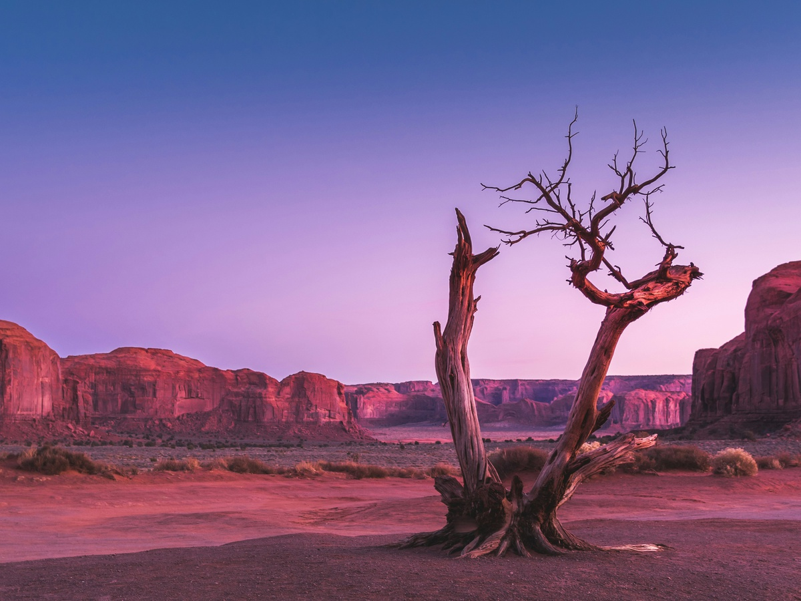
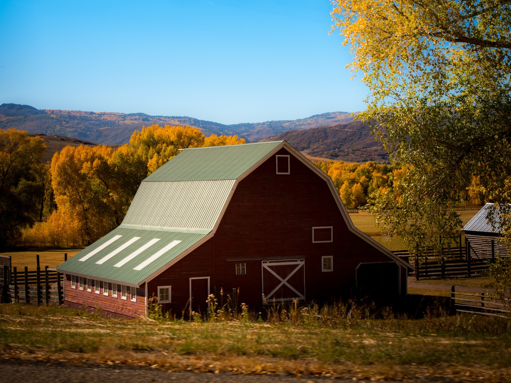
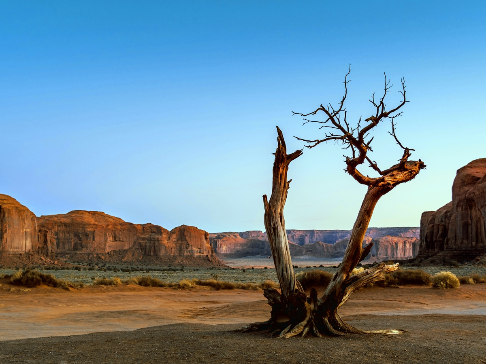
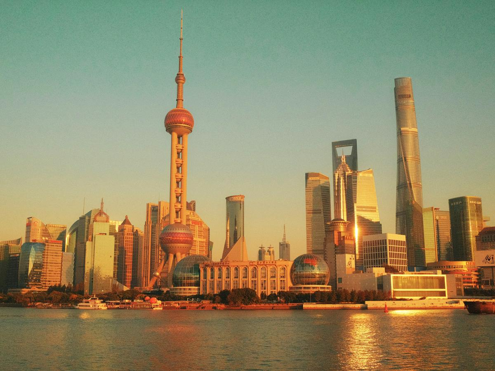
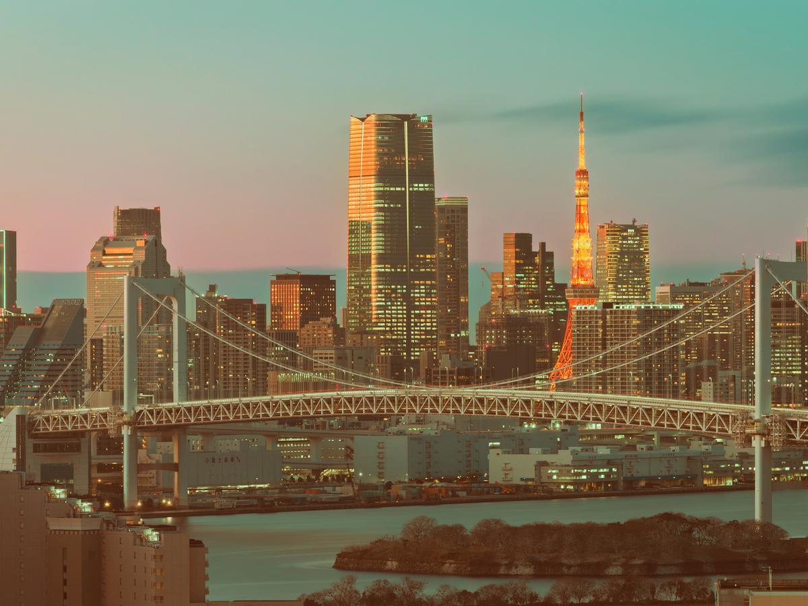

# ColorFM: An Optimization-to-Learning Framework for Color Transfer via Flow Matching

[Yuhang He](https://github.com/heyh31)1, [Kai Zhang](https://github.com/cszn)1†, Xiaoming Li1, Du Chen2, Jian Yang1

1Nanjing University, China  
2VIVO BlueImage Lab, China

  
  

___________

Online Demo
----------
[ColorFM-O Demo (Optimization-based)](https://huggingface.co/spaces/heyh97791/ColorFM-O)

[ColorFM-L Demo (Learning-based)](https://huggingface.co/spaces/heyh97791/ColorFM-L)

Visual Examples
----------

| Input | Style | Output |
|:---:|:---:|:---:|
|  |  |  |
|  |  |  |
|  |  |  |

