# [ColorFM: An Optimization-to-Learning Framework for Color Transfer via Flow Matching](https://arxiv.org/abs/2607.07119)

<p align="center">
  <a href="https://github.com/heyh31">Yuhang He</a><sup>1</sup>,
  <a href="https://github.com/cszn">Kai Zhang</a><sup>1,&#8224;</sup>,
  Xiaoming Li<sup>1</sup>,
  Du Chen<sup>2</sup>,
  Jian Yang<sup>1</sup>
</p>

<p align="center">
  <sup>1</sup>Nanjing University, China &nbsp;&nbsp;
  <sup>2</sup>VIVO BlueImage Lab, China<br>
  <sup>&#8224;</sup>Corresponding author
</p>

<p align="center"><strong>ECCV 2026</strong></p>

<p align="center">
  <a href="https://arxiv.org/abs/2607.07119">
    
  </a>
  <a href="https://heyh31.github.io/ColorFM_page/">
    
  </a>
</p>

<p align="center">
  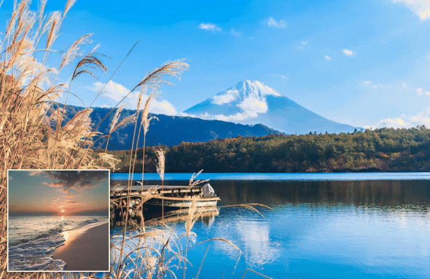
  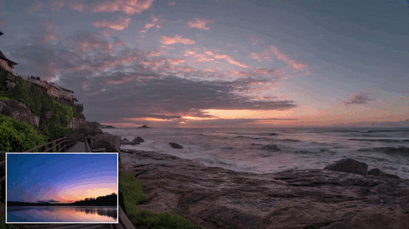
</p>

<p align="center">
  <em>ColorFM image color transfer (left) and video color transfer (right).</em>
</p>

<p align="center">
  <strong>🚀 Explore more application results:</strong>
  <a href="#image-color-transfer"><strong>Image Color Transfer</strong></a>
  &nbsp;|&nbsp;
  <a href="#video-color-transfer"><strong>Video Color Transfer</strong></a>
</p>

---

- [ColorFM: An Optimization-to-Learning Framework for Color Transfer via Flow Matching](#colorfm-an-optimization-to-learning-framework-for-color-transfer-via-flow-matching)
  - [Overview](#overview)
  - [Online Demos](#online-demos)
  - [Testing](#testing)
  - [Training](#training)
    - [Stage 1: Generate training pairs with ColorFM-O](#stage-1-generate-training-pairs-with-colorfm-o)
    - [Stage 2: Train the offline ColorFM-L model](#stage-2-train-the-offline-colorfm-l-model)
    - [Evaluate ColorFM-L](#evaluate-colorfm-l)
  - [Method](#method)
  - [Quantitative Results](#quantitative-results)
  - [Image Color Transfer](#image-color-transfer)
  - [Video Color Transfer](#video-color-transfer)
  - [Acknowledgements](#acknowledgements)
  - [Citation](#citation)
  - [License](#license)

Overview
----------

ColorFM is an optimization-to-learning framework for accurate and semantically consistent color transfer. It connects instance-specific optimization with efficient feed-forward inference through two complementary variants: ColorFM-O and ColorFM-L.

Online Demos
----------

| Method | Type | Demo |
|:---:|:---:|:---:|
| ColorFM-O | Optimization-based | [Try online](https://huggingface.co/spaces/heyh97791/ColorFM-O) |
| ColorFM-L | Learning-based | [Try online](https://huggingface.co/spaces/heyh97791/ColorFM-L) |


Testing
----------
Create an environment and install the dependencies:

```bash
conda create -n ColorFM python=3.10 -y
conda activate ColorFM
pip install torch torchvision
pip install -r requirements.txt

# Optional: accelerate ColorFM-L on supported CUDA environments 
# https://github.com/facebookresearch/xformers
```

Run the **image color transfer** WebUI from the repository root:

```bash
# Optimization-based ColorFM-O
python app_colorfm_o.py

# Learning-based ColorFM-L
python app_colorfm_l.py
```

Run the **video color transfer** WebUI:

```bash
# Optimization-based ColorFM-O video transfer
python app_colorfm_o_video.py

# Learning-based ColorFM-L video transfer
python app_colorfm_l_video.py
```

Both video applications support OpenCV encoding. FFmpeg is recommended for H.264 output and retaining the source audio:

```bash
conda install -n ColorFM -c conda-forge ffmpeg
```

Please download [ckpt](https://huggingface.co/heyh97791/ColorFM) and place it under the ``checkpoints`` folder. The checkpoint is required by both ColorFM-L image and video applications. ColorFM-O performs instance-specific optimization and does not require a pretrained checkpoint.

Training
----------

ColorFM training consists of two stages. Stage 1 uses ColorFM-O to generate pairs. Stage 2 uses these generated pairs to train the offline ColorFM-L model.

### Stage 1: Generate training pairs with ColorFM-O

Place the source images in one folder. Because Stage 1 uses `_` to separate the content and style names in `a_b.png`, it is recommended to rename the source images with numeric names first:

```bash
python rename_images.py \
  --input-dir /data/set_a/original_images \
  --output-path /data/set_a/images
```

This copies the images to the output folder as `001.jpg`, `002.jpg`, and so on while preserving the source images. Then generate the training pairs:

```bash
python main_train_stage1.py \
  --input-dir /data/set_a/images \
  --output-dir /data/set_a/styled
```

Every two different images are paired in both directions. If `a.png` is the content image and `b.png` is the style image, the generated result is saved as:

```text
/data/set_a/styled/a_b.png
```

For large-scale pair generation, multiple tasks can run in parallel. Use `run_train_stage1_parallel.sh` as a template for configuring the dataset paths, CUDA devices, and task ranges:

```bash
bash run_train_stage1_parallel.sh
```

### Stage 2: Train the offline ColorFM-L model

Configure the training datasets and CUDA devices in `configs/colorfm_l.yaml`. The dataset paths are matched by position: `image_dir[0]` corresponds to `styled_dir[0]`, `image_dir[1]` corresponds to `styled_dir[1]`, and so on. All matched datasets are combined for training. Set `eval_path: []` to disable evaluation.

When evaluation is enabled, follow the instructions in `metrics/ckpt_download` to download and place the required metric weights.

Start Stage 2 training:

```bash
python main_train_stage2.py
```

Training automatically resumes from `outputs/<exp_name>/checkpoints/last.ckpt` when that file exists. A specific checkpoint can also be selected explicitly:

```bash
python main_train_stage2.py --resume /path/to/checkpoint.ckpt
```

The experiment outputs are organized as follows:

```text
outputs/<exp_name>/
├── checkpoints/
│   ├── colorfm_l_epoch=004.ckpt
│   ├── last.ckpt
│   └── colorfm_l.pth
└── logs/
    └── version_0/
```

TensorBoard records the training losses and, when evaluation is enabled, Content Similarity, Lipschitz, and Style Similarity:

```bash
tensorboard --logdir outputs/<exp_name>/logs
```

### Evaluate ColorFM-L

Before evaluation, follow `metrics/ckpt_download` to place the LDC and Style Similarity weights in the `metrics` folder. The evaluation script accepts both a plain ColorFM-L `.pth` weight file and a Lightning `.ckpt` checkpoint:

```bash
python main_eval_colorfm_l.py \
  --checkpoint checkpoints/colorfm_l.pth \
  --eval-path /data/eval_images \
  --output-dir outputs/colorfm_l_eval
```

Multiple evaluation folders can be passed after `--eval-path`. Each folder is evaluated using all directed pairs of different images:

```bash
python main_eval_colorfm_l.py \
  --checkpoint checkpoints/colorfm_l.pth \
  --eval-path /data/eval_a /data/eval_b \
  --output-dir outputs/colorfm_l_eval
```

By default, content images are resized to `data.eval_image_size` from `configs/colorfm_l.yaml`. Add `--full-resolution` to keep the original content resolution in the generated results:

```bash
python main_eval_colorfm_l.py \
  --checkpoint checkpoints/colorfm_l.pth \
  --eval-path /data/eval_images \
  --output-dir outputs/colorfm_l_eval \
  --full-resolution
```

Generated images are named `content_style.png`. The number of saved results is controlled by `solver.eval_save_images` in the config: `-1` saves all results, `0` disables saving, and a positive value saves the first N results. If `--output-dir` is omitted, images are saved to `outputs/<exp_name>/eval_images`. 


Method
----------

ColorFM formulates color transfer as transporting pixel distributions along velocity fields via Flow Matching. ColorFM-O optimizes an instance-specific velocity field with semantic guidance, while ColorFM-L learns from the generated pairs to provide efficient feed-forward inference.

<p align="center">
  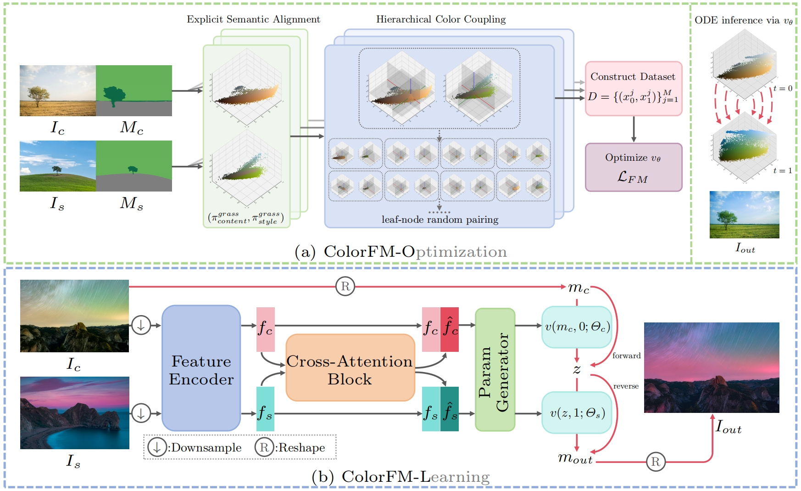
</p>

<p align="center"><em>Overview of the ColorFM-O and ColorFM-L frameworks.</em></p>

<!--
Algorithm figure placeholder. Expected file:
static/images/method/colorfm-algorithm.png

<p align="center">
  
</p>
-->

Quantitative Results
----------

The following table compares ColorFM with existing color transfer methods in terms of similarity, Lipschitz constant, and inference time. All results are evaluated at an image resolution of 512 x 512.

<p align="center">
  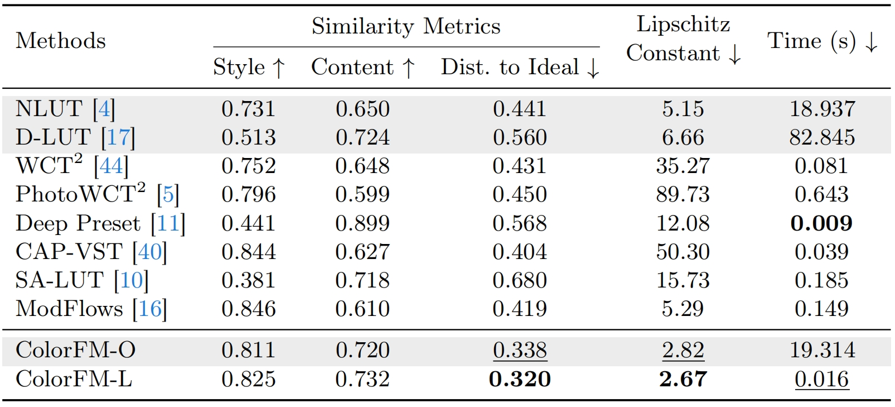
</p>

Image Color Transfer
----------

<p align="center">
  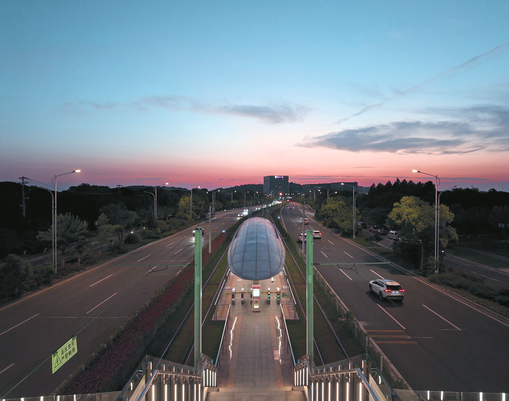
  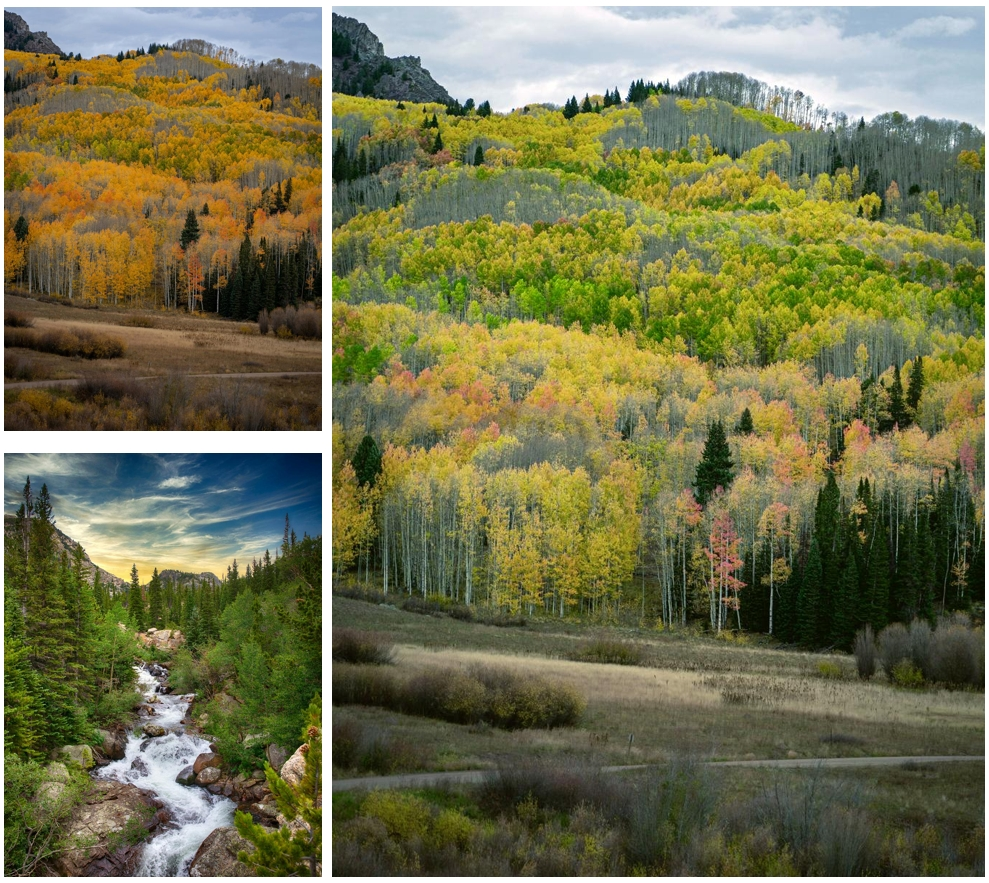
  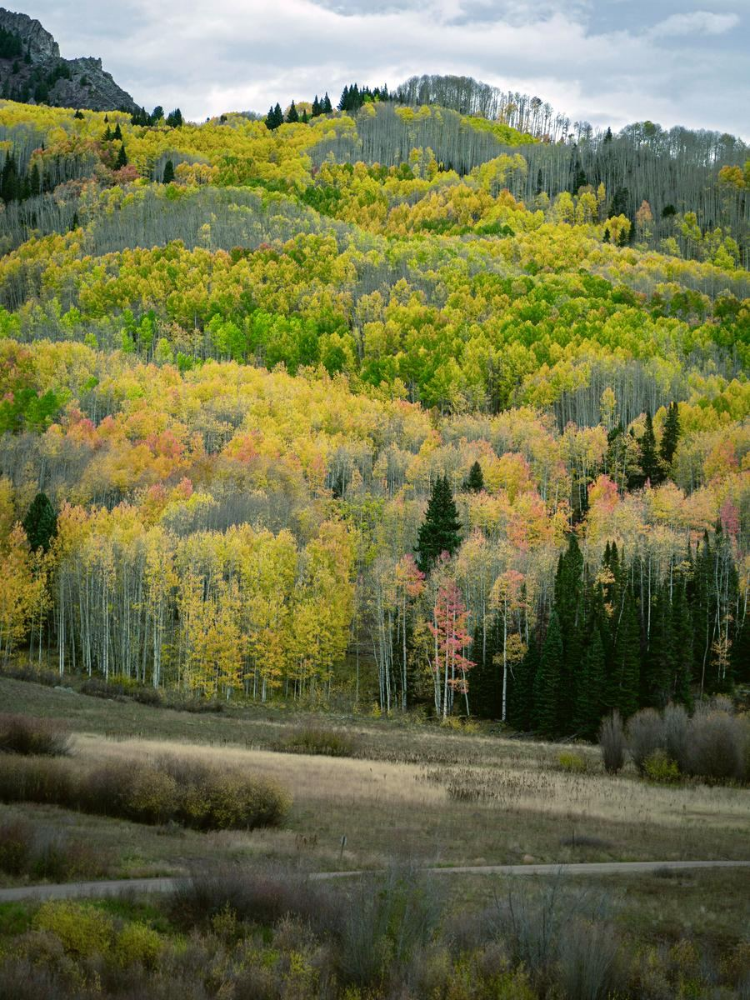
</p>

<p align="center">
  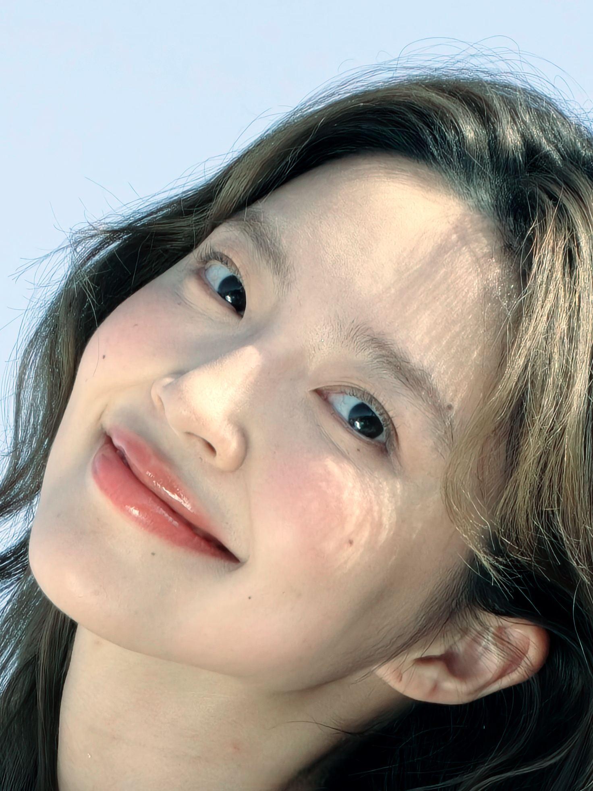
  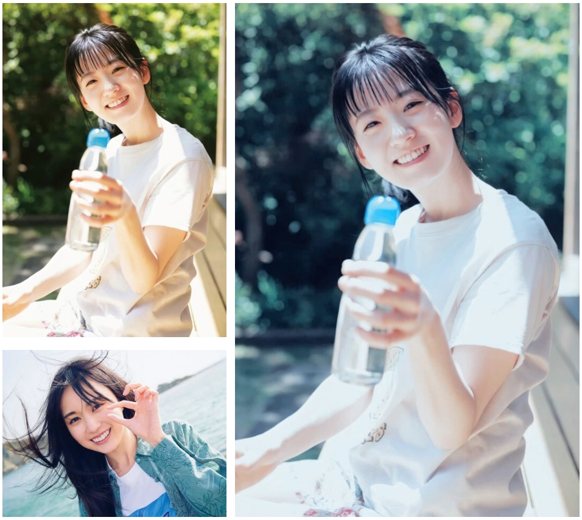
  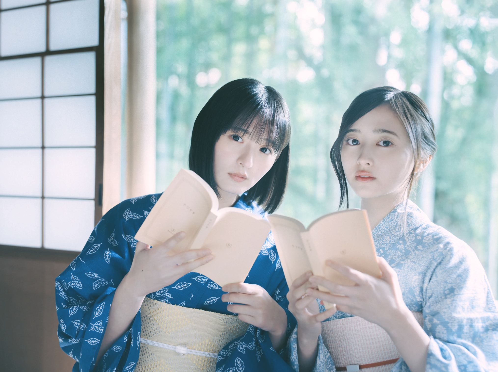
</p>

<p align="center">
  
  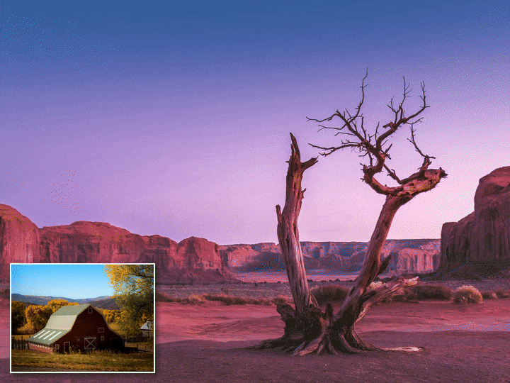
  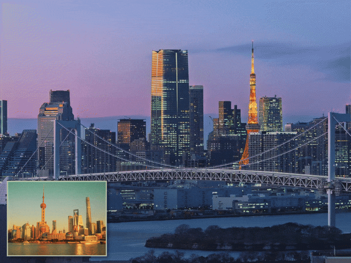
</p>

Video Color Transfer
----------

<p align="center">
  
  
</p>

Acknowledgements
----------

This project builds upon the open-source implementations of [DINOv2](https://github.com/facebookresearch/dinov2) by Meta AI.

Citation
----------

If you find this work useful, please cite:

```bibtex
@misc{he2026ColorFM,
      title={ColorFM: An Optimization-to-Learning Framework for Color Transfer via Flow Matching}, 
      author={Yuhang He and Kai Zhang and Xiaoming Li and Du Chen and Jian Yang},
      year={2026},
      eprint={2607.07119},
      url={https://arxiv.org/abs/2607.07119}, 
}
```

License
----------

This project is released under the [Apache License 2.0](LICENSE).
